# __studbud-2022__

## __Overview__

In this assessment, the main layout and style are the same as those in A2, but some details have been changed on this basis.Addtionally,the web page is adapted with iPhone 12 Pro.The following is an overview of the prototype of this webpage:

>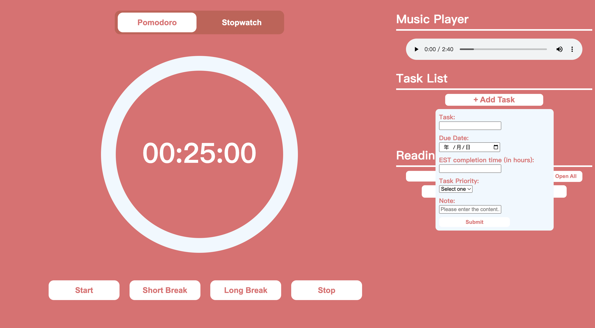

>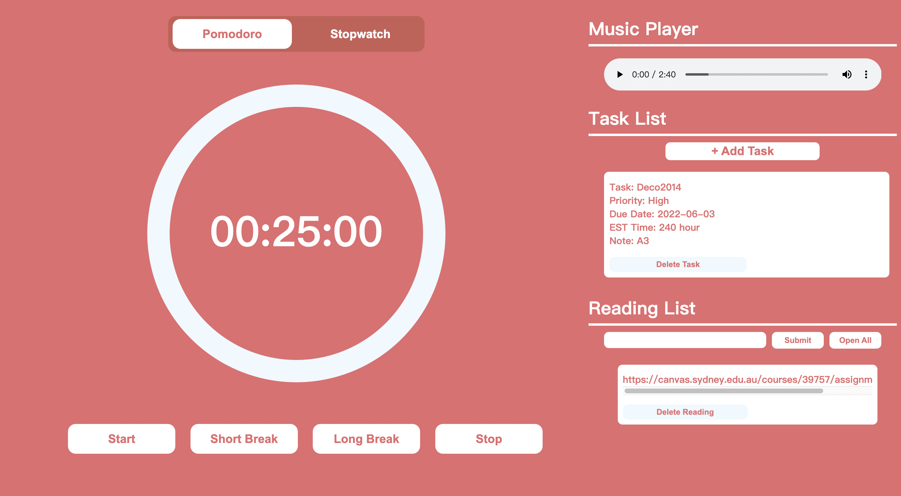

## __Changes__

There are few changes have been made in this design, they are :
>1. Content layout adjustment
>1. Button adjustment
>1. Pop-up window adjustment

__Firstly, the content layout adjustment:__

The at the first desgin the music player was located below the reading list, but there will be a problem, when the user add task or reading, the music player will be push down ward due to the addee content.Therefore, the music player position was be change to the top of the task list to prevent the music player be push down ward by the added content.

__Old music player location:__
>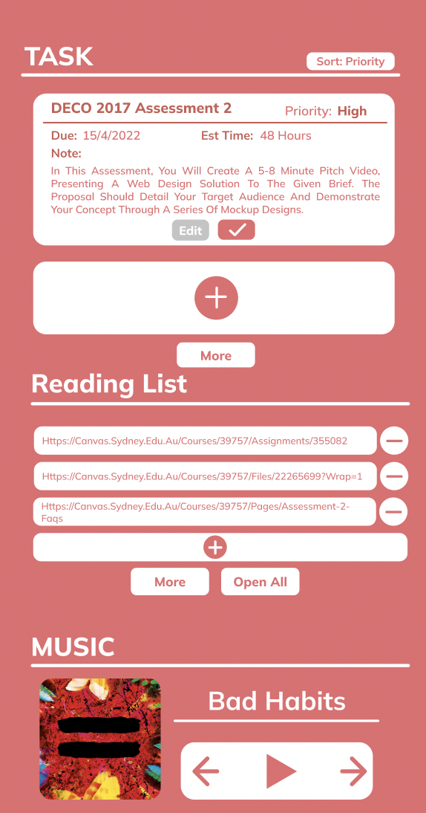

__New music player location:__
>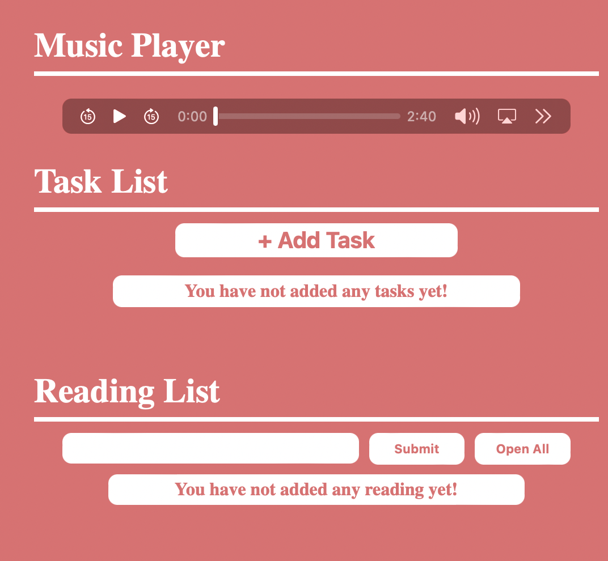

__Secondly, the button adjustment:__

On this assessment, the button of the add task has been changed, from the last assessment the button has the same problem as the music player. Therefore, the loaction of the button has been changed to the top of the content card, and the style also been changed from circular with the icon to rounded rectangular with text and icon. The reason for doing this are the readability will increase and the button style will more sutiable will the overall desgin.

__Old button style and location:__
>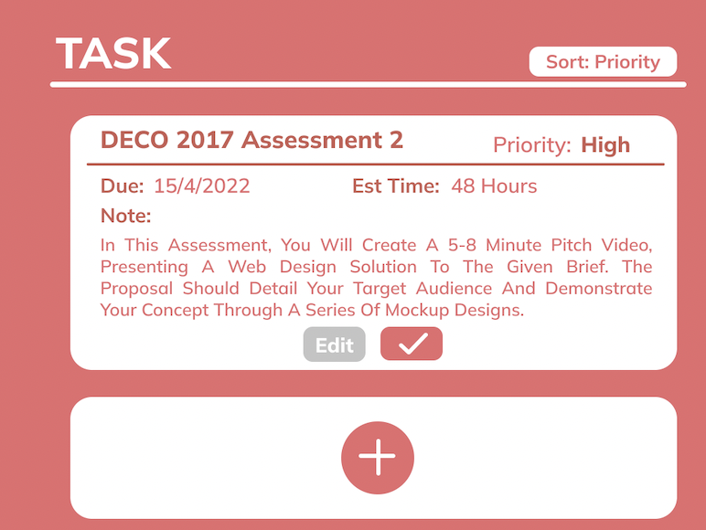

__New button style and location:__
>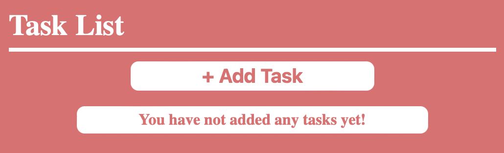

The button for add reading also been changed, originaly it hava a delicated add reading button, However, if the user wants to copy the link in, this extra button will be redundant, because the user doesn't need to click Add first, then the input box will appear, and finally copy the content in. It is more reasonable and efficient to directly display the input box with the submit button, which also reduces the steps of the user. In addition, the position of "Open All" button has also been changed next to submitting Reading, which can prevent the button been push down ward by the added content.

__Old reading button style and location:__
>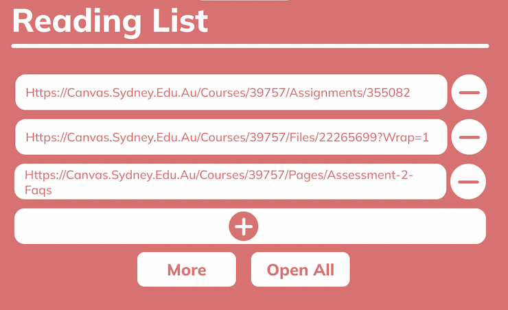

__New reading button style and location:__
>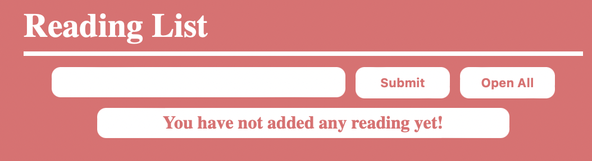

At the end of the second part, the button of reading list has been changed, and the button of deleting reading has been moved to the bottom of the content, which can give more space for links.

__Old reading delete button style and location:__
>

__New reading delete button style and location:__
>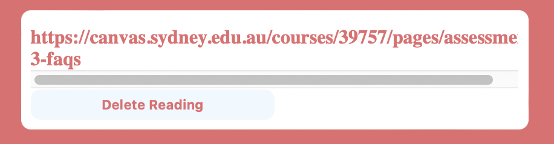

__Thirdly, Pop-up window adjustment:__

In this Assessment, the form pop-up window was changed when adding tasks. The original pop-up window design was that it would appear in the middle of the screen after pressing the add button and the background would be blurred. However, because the pop-up window appeared in the middle of the screen, a lot of contents would be blocked. Therefore, the current task pop-up window has been moved to the bottom of the Add Task button and only a small window will be displayed, so that the blocked content is greatly reduced and more compact.

__Old Pop-up window style and location:__
>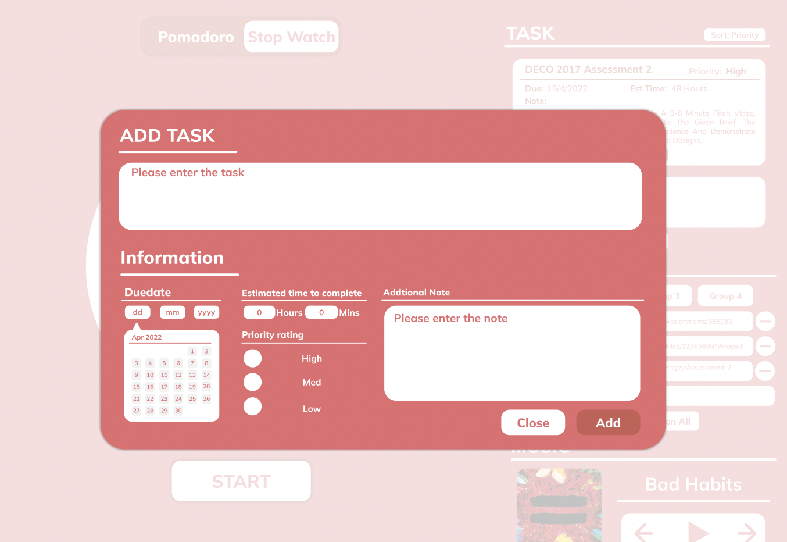

__New Pop-up window style and location:__
>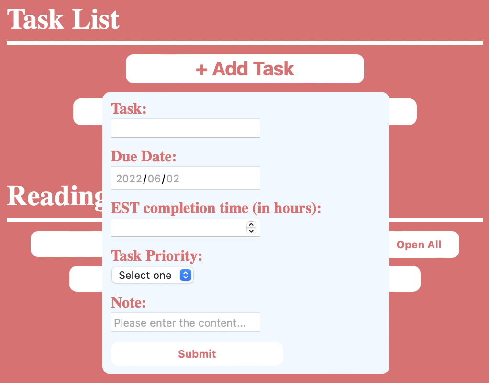

## __Challenges__

In this Assessment, the challenge is that after the user creates a new Task, the displayed effect does not meet the expectation and the design of the previous Assessment, because the added content is in a whole paragraph, so it is not obvious to add the effect to him even if CSS is used, because it involves the structural problem, so the Assessment here does not meet the design expectation.

__Desgin from A2:__
>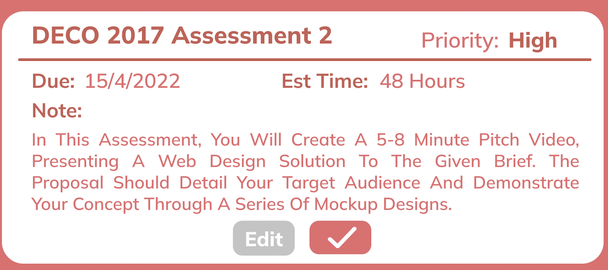

__Desgin from A3:__
>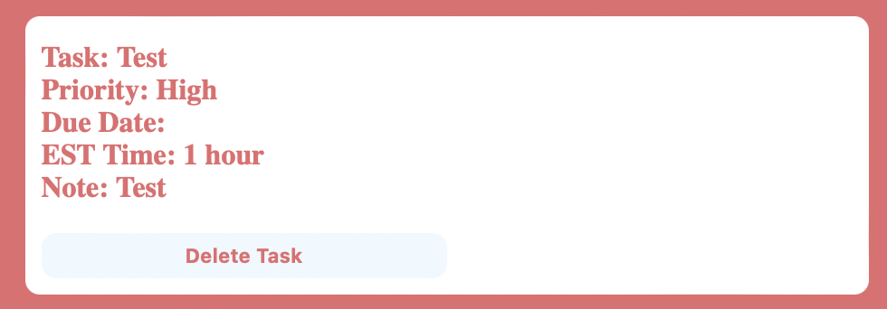

Another challenge from this assessment is the sorted by date and priority, in the coding process, I can't figure out how to solve it, so i delete the button

__Desgin from A2:__
>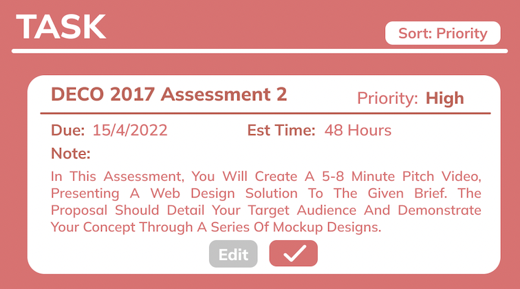

__Desgin from A3:__
>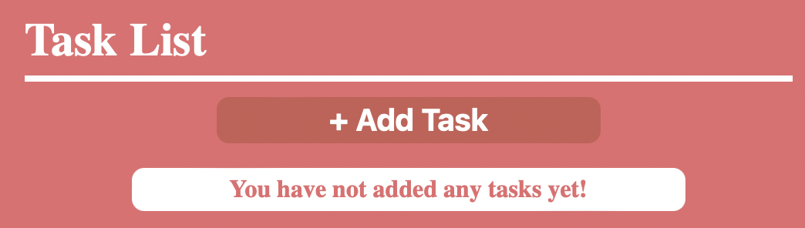

## __Reference__

Gupta,R.(2016).Pomodoro Timer : : Javascript.Retrieved from: https://codepen.io/rajdgreat007/pen/edvZpx.

Scott Holmes Music.(2017).Strategy.Retrieved from: https://freemusicarchive.org/music/Scott_Holmes/corporate-motivational-music/strategy-2/.

Code for Task list and Reading List are inspired by tutorial.

